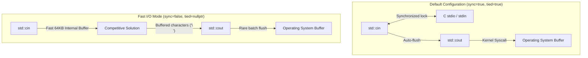

# Fast I/O — Visual Memory Architecture

## 1. Stream Decoupling Mechanism

```mermaid
flowchart TD
    subgraph Default["Default Configuration (sync=true, tied=true)"]
        Cin1["std::cin"] <-->|"Synchronized lock"| Scanf1["C stdio / stdin"]
        Cin1 -->|"Auto-flush"| Cout1["std::cout"]
        Cout1 -->|"Kernel Syscall"| OS1["Operating System Buffer"]
    end

    subgraph FastMode["Fast I/O Mode (sync=false, tied=nullptr)"]
        Cin2["std::cin"] -->|"Fast 64KB Internal Buffer"| App["Competitive Solution"]
        App -->|"Buffered characters ('\\n')"| Cout2["std::cout"]
        Cout2 -->|"Rare batch flush"| OS2["Operating System Buffer"]
    end
```
